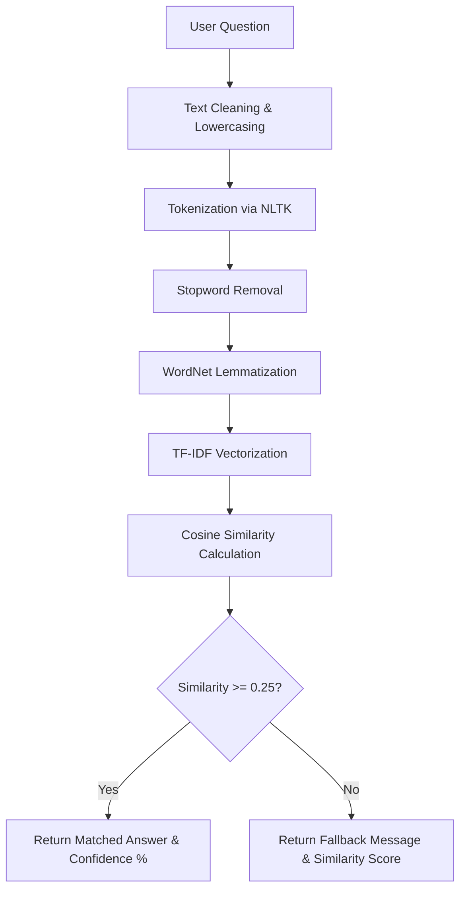

# AI FAQ Chatbot - CodeAlpha Internship Task 2

A production-ready, intelligent FAQ Chatbot built using Python, Flask, and Natural Language Processing (NLP) techniques. The system preprocesses questions using NLTK (lowercasing, punctuation removal, tokenization, stopword removal, and WordNet lemmatization), converts them to TF-IDF vectors, and uses Cosine Similarity to find the best match from a predefined dataset. It features a modern glassmorphic web interface with dark/light themes, voice input, interactive FAQ search, and chat transcript export features.

---

## 🌟 Key Features

- **NLP-Powered Pipeline**: Cleans, tokenizes, filters stopwords, and lemmatizes user queries dynamically.
- **Cosine Similarity Matching**: Computes mathematical similarity between user questions and the database to locate the most relevant response.
- **Confidence Scoring**: Shows percentage scores for matched answers, triggering an adaptive fallback response for scores under 25%.
- **Modern Glassmorphic UI**: Beautiful desktop and responsive mobile layout with frosted-glass overlays, fluid animations, and visual status logs.
- **Aesthetic Theme Switcher**: Toggle between sleek dark-violet and soft blue-light themes instantly.
- **Interactive FAQ Database Sidebar**: Search and preview all 23 database questions; click any question to immediately prompt the bot.
- **Voice Search (Web Speech API)**: Speak your questions directly through voice input with a listening wave overlay.
- **Chat History Export**: Download a full, timestamps-annotated text transcript of your chatbot conversation.
- **Render Cloud Ready**: Fully configured out-of-the-box with `Procfile`, `runtime.txt`, `requirements.txt`, and automated NLTK data directories.

---

## ⚙️ Technology Stack

- **Backend Framework**: Flask 3.1.0 (Python 3.11)
- **Natural Language Processing**: NLTK 3.9.1
- **Machine Learning Vectors**: Scikit-learn 1.6.1 (TF-IDF Vectorizer & Cosine Similarity)
- **Mathematical Compute**: NumPy 2.2.6
- **Frontend Architecture**: HTML5, Vanilla CSS3 (Custom variables, Keyframes, Flexbox/Grid), JavaScript (ES6+, Web Speech API)
- **WSGI server (Production)**: Gunicorn 23.0.0

---

## 📂 Project Structure

```text
CodeAlpha_FAQ_Chatbot/
│
├── app.py                  # Core Flask server, routing, and NLP similarity logic
├── requirements.txt        # Production Python dependencies
├── Procfile                # Gunicorn process manager definition for Render
├── runtime.txt             # Environment Python runtime specification
├── .gitignore              # Files/folders excluded from git version control
├── README.md               # Extensive project documentation
│
├── data/
│   └── faqs.json           # Frequently Asked Questions database (20+ items)
│
├── templates/
│   └── index.html          # Chat interface template (Glassmorphism layout)
│
└── static/
    ├── style.css           # Styling rules, variables, animations, and dark/light modes
    └── script.js           # AJAX fetch calls, voice search, sidebar filter, and controls
```

---

## 🧠 NLP & Similarity Matching Pipeline

The system uses the following pipeline to process user queries and retrieve the most relevant answer:



### 1. Preprocessing (NLTK)
- **Lowercasing**: Normalizes casing variations.
- **Punctuation Stripping**: Eliminates noise punctuation using regex.
- **Word Tokenization**: Separates strings into distinct token lists.
- **Stopwords Removal**: Filters out common English connecting words (like *the*, *is*, *at*, *which*).
- **WordNet Lemmatization**: Resolves words to their root dictionary form (e.g., *running* or *ran* to *run*) to ensure better vocabulary alignment.

### 2. Matching (TF-IDF & Cosine Similarity)
- **TF-IDF Vectorizer**: Converts the preprocessed FAQ database questions into numerical vectors representing terms and document frequencies.
- **Cosine Similarity**: Measures the cosine angle between the user's vector and each FAQ vector. A similarity score of `1.0` is a perfect match, and `0.0` means no word intersection.
- **Confidence Threshold**: A minimum score of `0.25` is required to deliver a matched response. If the score falls below this, the bot provides a friendly rephrasing fallback.

---

## 🚀 Installation & Local Setup

### Prerequisites
- Python 3.11 installed on your local computer.
- Git CLI (optional).

### Steps
1. **Clone the repository**:
   ```bash
   git clone https://github.com/sahith8639/IntelliFAQ.git
   cd IntelliFAQ
   ```
   *(Note: Replace with your actual GitHub username if different)*

2. **Create a virtual environment**:
   ```bash
   python -m venv venv
   ```

3. **Activate the virtual environment**:
   - **Windows (PowerShell)**:
     ```powershell
     .\venv\Scripts\Activate.ps1
     ```
   - **Windows (CMD)**:
     ```cmd
     .\venv\Scripts\activate.bat
     ```
   - **macOS / Linux**:
     ```bash
     source venv/bin/activate
     ```

4. **Install dependencies**:
   ```bash
   pip install -r requirements.txt
   ```
   *The application will automatically download all required NLTK resources (`punkt`, `stopwords`, `wordnet`, `omw-1.4`) into a local folder `nltk_data` during its initial run.*

5. **Run the Flask application**:
   ```bash
   python app.py
   ```

6. **Open in browser**:
   Navigate to `http://localhost:5000` to interact with your Chatbot!

---

## 🌐 API Endpoints

### 1. Render Chat Interface
- **Endpoint**: `GET /`
- **Description**: Serves the frontend web interface files.

### 2. Process Chat Question
- **Endpoint**: `POST /chat`
- **Headers**: `Content-Type: application/json`
- **Request Body**:
  ```json
  {
    "message": "What is Natural Language Processing?"
  }
  ```
- **Response Body (Success)**:
  ```json
  {
    "answer": "Natural Language Processing is a field of artificial intelligence that focuses on the interaction between computers and human language...",
    "confidence": 94.65
  }
  ```
- **Response Body (Under Threshold / Fallback)**:
  ```json
  {
    "answer": "I'm sorry, I couldn't find a relevant answer. Please try rephrasing your question.",
    "confidence": 12.38
  }
  ```

### 3. Retrieve FAQ Directory
- **Endpoint**: `GET /api/faqs`
- **Description**: Returns a quick indexing list of all FAQ questions in the database. Used by the search list in the sidebar.

---

## ☁️ Deployment on Render

This project is pre-configured for seamless hosting on **Render** (or Heroku).

1. **Commit and push** all code files to your GitHub repository.
2. Log in to your [Render Dashboard](https://dashboard.render.com).
3. Click **New +** and select **Web Service**.
4. Connect your GitHub repository.
5. In the configuration options, set:
   - **Runtime**: `Python`
   - **Build Command**: `pip install -r requirements.txt`
   - **Start Command**: `gunicorn app:app`
6. Click **Deploy Web Service**. Render will spin up the environment, resolve Python dependencies, execute the start script, download NLTK data automatically, and serve your app.

---

## 🖼️ User Interface Preview

*(You can replace this section with active screenshots of the web client after launching)*
- **Desktop Chat Client**: Glassmorphism chat bubble feeds and dynamic theme configurations.
- **FAQ Sidebar**: Filter search lists with quick click-to-query mechanics.
- **Voice Overlay**: Mic-active indicators during speech capturing.

---

## 🔮 Future Enhancements

- **Synonym Expansion**: Integrate WordNet synsets to handle queries that use completely different vocabulary words.
- **Generative AI Fallback**: Feed questions that fall below the 25% threshold to a lightweight LLM API (such as Google Gemini) to produce generative replies.
- **Vector Database**: Migrate the JSON structures to a light relational database (like SQLite) or a vector storage engine for scaling to thousands of FAQs.
- **User Feedback Loop**: Let users upvote/downvote chatbot answers to refine matching weights.

---

## 👨‍💻 Internship Project Details
- **Internship**: CodeAlpha Artificial Intelligence Internship
- **Task**: Task 2 - Chatbot for FAQs
- **Author**: Sahith Sai Pasupula
- **GitHub**: [sahith8639 Profile](https://github.com/sahith8639)
- **Repository**: [CodeAlpha_FAQ_Chatbot](https://github.com/sahith8639/IntelliFAQ)
